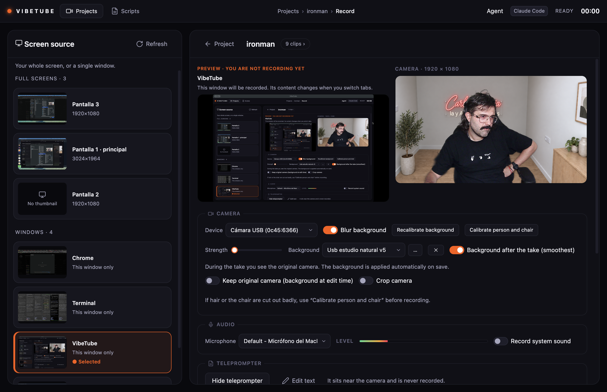
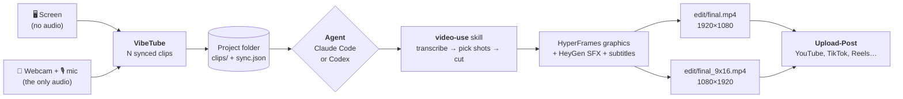
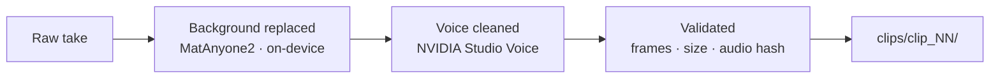
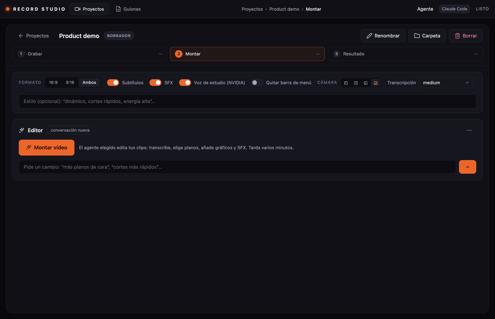
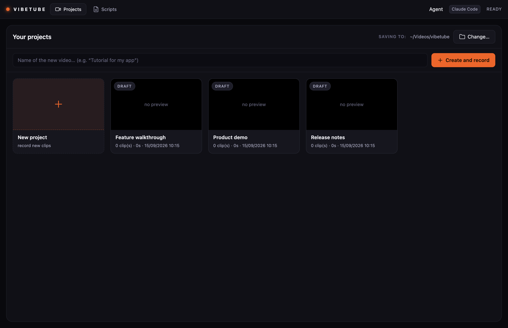
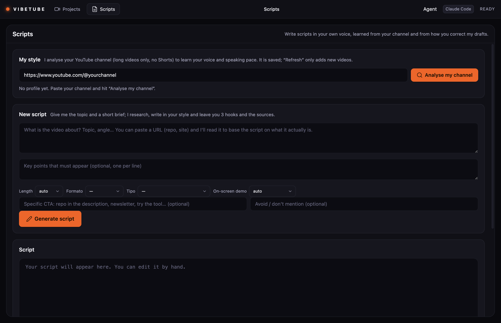

# VibeTube

Desktop **multicam recorder** (macOS / Electron). It captures your **screen** and your
**webcam + microphone** in sync, organises them into **projects made of several clips**, and
hands the folder to an AI coding agent — **Claude Code or Codex** — which edits the final
video for you: automatic shot selection (full-cam / screen / PiP), subtitles,
[**HyperFrames**](https://github.com/heygen-com/hyperframes) graphics and sound effects.

Then it **publishes it**. The same agent reads the subtitles of the finished cut and writes five
title options and a description with real chapters, and [**Upload-Post**](https://upload-post.com)
pushes the video straight to YouTube, TikTok, Reels and the rest — you never open a browser.
See [Publishing to YouTube & co.](#publishing-to-youtube--co) below.

You record. The agent edits and publishes.



## How it works



Every clip keeps two tracks on one timeline: `screen.webm` carries the picture only, and
`webcam.webm` carries your camera **and the microphone** — it is the single source of audio for
the whole project. `sync.json` stores the offset between them, so the editor can cut between
shots without ever breaking the voice.

What happens to each clip before the agent sees it:



## Requirements

- Node.js 22+ and npm
- macOS (uses Electron's `desktopCapturer` plus the Screen Recording permission)
- `ffmpeg` on your `PATH` (Homebrew recommended)
- For AI editing and scripts: **Claude Code or Codex CLI**, installed and signed in. The app
  reuses the configuration and authentication of whichever CLI you pick.
- For the editing step: the `video-use` skill with `ffmpeg` and `ELEVENLABS_API_KEY`
- For publishing: an [Upload-Post](https://upload-post.com) API key (`UPLOAD_POST_API_KEY`) in `~/.config/record-studio/.env`
- For voice enhancement: **NVIDIA Studio Voice NIM** (`NVIDIA_API_KEY` or `NGC_API_KEY` in
  `~/.config/record-studio/.env`)

## Getting started

```bash
npm install
npm start
```

**macOS permissions:** the first time, grant *Screen Recording*, *Camera* and *Microphone* to the
app (or to Electron in dev mode) under System Settings → Privacy & Security, then relaunch. If the
screen preview is black, check that permission and that the selected source still exists.

## Choosing Claude Code or Codex



In the top bar, **Agent → Codex** switches the agent used for the next edits, iterations, style
analysis and scripts. The choice persists across restarts; Claude Code is the default. Tasks and
terminals that are already running stay on the agent they started with.

To use Codex, install its CLI and sign in:

```bash
npm install -g @openai/codex
codex login
```

Automatic editing runs `codex exec --json`, and the built-in terminal opens Codex interactively.
Both use `workspace-write` with network access for research and downloads; automatic tasks never
ask for approvals, while the terminal does let you approve actions. The model is inherited from
your Codex configuration. See [Codex non-interactive mode](https://learn.chatgpt.com/docs/non-interactive-mode).

Each project keeps **one conversation per provider**: switching to Codex starts its own thread and
you can come back to the Claude one later. The interactive terminal resumes the provider's last
session in that folder. The montage brief is written to `AGENTS.md` for Codex and `CLAUDE.md` for
Claude, preserving any instructions already there. Both are given the path to the `video-use` skill
bundled with this app.

## Recording

### Projects tab



1. Pick the **root folder** where all projects will live.
2. Type a name and hit **＋ Create** (it becomes the active project).
3. The gallery shows every project: clip count, duration, date, and its **final edit** (poster
   plus ▶ to open it) when `edit/final.mp4` exists.

### Record tab

1. **Pick** the screen or window. Sources are grouped by type and labelled; the selected one is
   highlighted. **Refresh** reloads the list and its thumbnails.
2. Check the screen and webcam **previews**.
3. **● Record** → **3·2·1** countdown → talk or demo.
   - **⏸ Pause / ▶ Resume** within the same clip.
   - **■ Stop** closes the clip and adds it to the project.
4. Repeat: every Record→Stop adds `clip_02`, `clip_03`… **to the same project**.

### Demoing the app itself while recording

Turn on **Keep the interface visible while recording**, next
to the Record button. The setting persists: the main window stays open and capturable, and the small
floating controls appear as usual. Turned off, the main window hides during the take. Select the
screen, or the VibeTube window itself, to include the interface in the video.

You can leave the project and open **Projects**, **Scripts** or another project without interrupting
the take. The recorder keeps writing to the project where the session started, no matter which
screen you are showing. Its name is displayed in the floating controls.

- **⏸ / ▶** pause and resume the take.
- **■** saves the clip and leaves the small recorder ready for another.
- **●** starts another clip in the original project, even while viewing a different one.
- **↺** discards the current take and re-records into that same project.
- **✓** ends the recorder session.

Camera and microphone stay available between clips while that session is open. Navigating never
changes where the clip is saved, not even when in-memory buffering is used instead of streaming to
disk. The session's project cannot be deleted until you end it. Duplicate starts are blocked during
the countdown and while saving.

### Teleprompter

The teleprompter opens in a separate window that stays out of the capture. You can load a script,
edit it and restart the read. Line breaks from the original script are preserved.

## Project layout

```
<root>/<project>/
├── project.json                 ← metadata + clip list
├── clips/
│   ├── clip_01/ screen.webm  webcam.webm  webcam_orig.webm  webcam_enhanced.wav  sync.json
│   ├── clip_02/ ...
│   └── ...
└── edit/                        ← written by video-use
    ├── final.mp4  final_9x16.mp4  final.srt  _poster.jpg
    └── publish.json              ← titles, description with chapters, tags
```

| File | What it is |
|---|---|
| `screen.webm` | screen capture (no audio) |
| `webcam.webm` | your camera **+ mic** (remuxed with studio audio when Studio Voice is on) |
| `webcam_orig.webm` | backup of the untouched original camera audio/video |
| `webcam_enhanced.wav` | clean 48 kHz voice track from NVIDIA Studio Voice NIM |
| `sync.json` | offset between tracks, duration, real dimensions, enhancement status |
| `project.json` | name, dates and every clip with its metadata |

## Handoff to video-use

Open the project folder with the `video-use` skill and ask for what you want:

> "Edit this multicam recording: alternate between my camera and the screen depending on what I'm
> saying, PiP while I explain over the demo, a HyperFrames intro, and subtitles."

Continuous audio always comes from `webcam.webm`; only the video shot changes. The full contract
(mapping several clips, multicam EDL format) is in [`HANDOFF.md`](./HANDOFF.md).

## AI voice enhancement (NVIDIA Studio Voice NIM)

VibeTube integrates **NVIDIA Studio Voice NIM (`48k-hq`)** over gRPC to turn microphone audio
into studio-grade voice: it suppresses room echo, background noise, keyboards and air conditioning,
improving presence and clarity at 48 kHz.

**Ways to use it**

1. **Automatic after recording (background).** Once a take is stopped and validated, the app
   processes the audio on its own. A backup is kept (`webcam_orig.webm`) and the clean audio is
   remuxed into `webcam.webm` without re-encoding the video.
2. **On demand from the UI.**
   - **Per clip:** the ✨ button on each clip card processes or re-processes it.
   - **Whole project:** **`Enhance audio (AI)`** in the clip list header.
   - **Montage bar:** the **`Studio voice (NVIDIA)`** switch (on by default).
3. **Manually from the CLI:**
   ```bash
   # One clip:
   python video-use/helpers/enhance_voice.py --clip clips/clip_01

   # Every clip in the current project:
   python video-use/helpers/enhance_voice.py --all

   # A standalone audio or video file:
   python video-use/helpers/enhance_voice.py --input <file> --output <enhanced.wav>
   ```
   The helper automatically splits takes longer than 4.5 minutes with a soft crossfade, respecting
   the API limits.
4. **Whisper transcription** (`helpers/transcribe_whisper.py`) prefers `webcam_enhanced.wav` when it
   exists, which gives better lexical accuracy and tighter timestamps for subtitles and SFX.
5. **API key:** store it in `~/.config/record-studio/.env`:
   ```env
   NVIDIA_API_KEY=nvapi-...
   ```
   With no key, or offline, the app simply skips enhancement without interrupting recording or
   editing.

## Publishing to YouTube & co.

Once the final cut exists, the **Result** step can send it straight out through
[Upload-Post](https://upload-post.com) — no manual upload, no browser.

Before that, hit **Titles & description** and the agent reads the subtitles of the *final cut*
(`edit/final.srt`) and writes `edit/publish.json` with:

- **five title options**, each with a different angle (descriptive, a number, curiosity, the problem
  it solves, a bold claim) — you pick one or edit it;
- a **YouTube description** whose chapter list comes from the real subtitle timestamps, so the
  chapters land on what is actually said, not on a guess. The first chapter starts at `00:00` and
  each one lasts at least 10 s, which is what YouTube requires to show them;
- **tags**.

It is cached: reopening the project reuses `publish.json` instead of paying for the agent again.

Then pick the profile, which file (16:9 for YouTube, 9:16 for Shorts/Reels/TikTok) and the
platforms — only the ones that profile actually has connected are listed. YouTube visibility
defaults to **private**, so a mistake is never published to your audience. Publishing asks for
confirmation, then polls until every platform is done and shows the resulting links.

```env
# ~/.config/record-studio/.env
UPLOAD_POST_API_KEY=…
```

Without that key the panel simply explains what is missing; nothing else in the app changes. The
video is read and streamed from the main process, so the API key never reaches the renderer.

## Scripts



1. **My style** — paste your channel and the agent (headless) downloads ~15 long transcripts with
   `yt-dlp`, then writes `_scripts/style_profile.md` and `_scripts/pace.json` (your real words per
   minute). "Update" only adds new videos to the corpus.
2. **New script** — a topic (a URL works too) plus a short brief: length, format, type, demo, CTA,
   things to avoid, key points. The agent researches the web, writes in your voice with a word
   target computed from your own pace, proposes **3 hooks** and leaves the **sources** in
   `drafts/<id>.sources.md` so you can check the numbers yourself.
3. **Script** — edit it, ask for "Hooks" (5 alternatives) or "Rewrite" (the previous version is kept
   in `drafts/versions/`), then "Record with this script" creates the project with `script.md` and
   stores the draft→final pair in `_scripts/feedback/`, which the agent uses in later scripts to
   learn how you correct it.

## Recording robustness

- **Full HD camera.** 1920×1080 at 30 FPS is requested with no artificial browser scaling. The app
  shows the resolution the device actually accepts and, when cropping, the resolution of the
  resulting file. Turn off "Crop camera" to keep the full 1920×1080. Lower-resolution cameras
  keep whatever they can deliver; AI background removal may reduce the frame rate.
- **Camera compression.** The VP9 budget scales with the recorded pixels, around 16.6 Mb/s for Full
  HD (it used to ask for 4 Mb/s at any size). Real bitrate depends on content and encoder. Cropping
  declares the even dimensions that are actually encoded up front.
- **Background edges.** Core Image refines the MatAnyone2 alpha with `CIGuidedFilter`, using the
  same camera frame as guide at up to 960×540. This reduces the stair-stepping when upscaling the
  original 288×512 mask. The person's RGB keeps capture resolution. No hair/chair heuristics are
  added and the model's temporal memory is untouched.
- **Background engine.** **MatAnyone2Kit** on Apple Silicon once `npm run build:matting` has run. It
  keeps memory between frames and initialises from Vision's full person mask. Other machines use
  LiveKit Track Processors 0.8.0. Models run locally: no account, no video leaves the machine.
  Closing the effect does not stop the camera or its audio. Errors are reported rather than silently
  falling back to another engine. Cut-out mistakes are still possible depending on chair and
  lighting.
  On Apple Silicon, **"Background after the take (smoothest)" is on by default**: the original camera is
  recorded and MatAnyone2 is applied afterwards. Turn it off to record the live effect instead.
- **Calibrate person and chair.** Mark your torso and the chair back on a still frame. With EdgeSAM
  installed, that selection initialises MatAnyone2 so both are preserved. The camera stays visible
  while it computes, and cancelling leaves the current cut-out untouched. Model installation and
  tests: [native/README.md](native/README.md).
- **Camera cropping.** Cropped pixels are materialised before reaching the encoder. This fixes the
  black VP9 clips produced by cropping an RGBA texture with `visibleRect`. Cropping also works with
  the window hidden, and stopping it preserves the original camera track. Files already recorded
  with black frames cannot be recovered by this fix.
- **Audio sync.** When recording the MatAnyone2-processed camera, the microphone (or the mix with
  system sound) is compensated for the measured video latency. The delay is set up before the
  recorders start and released at the end. The offset against the screen subtracts that delay.
- **Crash safety.** MediaRecorder chunks are written to disk about every second
  (`clips/clip_NN/*.part.webm`). If the app dies mid-take, the project shows the unfinished take and
  offers to **recover** it.
- **Validation.** On save, `ffprobe` measures the real duration of each track and marks the clip
  `truncated`/`empty` when it does not match (red chip on the card). A watchdog warns in the floating
  bar when a recorder stops delivering data for more than 3 s.
- Low disk space warning (<2 GB) before recording, and a confirmation when closing mid-take.
- Shortcuts: `⌘R` record/stop (Record view), `⌘⇧P` pause, `Esc` close modals; during a take `⌘⇧1`
  pauses, `⌘⇧2` ends the clip, `⌘⇧3` discards and re-records.

## Measured performance and known limits

These are real measurements on the development machine (M1 Pro), not targets. They are kept here
because the honest numbers matter more than the nominal ones.

**13 September 2026.** The USB camera delivers 1920×1080 at 30 FPS. The synthetic Full HD encoding
test keeps 90 frames in three seconds, both uncropped and cropped to 1388×952, checking decoded
pixels to catch black output. That test has no AI in the path — it is not a 30 FPS measurement with
MatAnyone2. Full HD composition with MatAnyone2 and VP9 came out around **10 FPS**, below the 12 FPS
threshold of the manual regression. Live background smoothness is **not** considered solved.

**11 September 2026.** Preview went from roughly **15 to 18 FPS**. With camera, screen and floating
controls at once it sat around **13 FPS**, against about **11 FPS** for the previous reference clip.
VP8 and H.264 tests did not justify changing the codec at that point. The synthetic flash-and-tone
test, with 90 ms of simulated processing, went from about **124 ms of average offset to about 9 ms**
in absolute value once compensation was added.

**14 September 2026 — codec change.** A check with real USB footage found live VP9 storing only 120
frames in about 18 seconds (6.6 FPS), even though the processed file reported 30 FPS by repetition.
The screen kept about 29 FPS. Over a six-second comparison per codec, H.264 stored all 140 frames it
received; VP9 stored 53 of 80 and VP8 132 of 150. **The camera now prefers H.264.** Chromium wraps
it with Opus in Matroska, keeping the project's `.webm` paths; the player and FFmpeg read the file
header. A later full test with USB and screen simultaneously stored 502 frames in 19.993 s
(**25.06 real FPS**), with no gaps over 81 ms.

**30 real FPS on this USB camera is still open.** A later measurement with no AI and no encoding
gave 25 FPS on Electron 33, with both `ideal: 30` and `exact: 30`. Electron 44.3.0 / Chromium 152,
tested separately, gave roughly 27.7 FPS with and without H.264. Dropping the constraint, asking for
60 ideal FPS, using the native 30.00003 FPS rate or going down to 720p did not reach 30 FPS.
AVFoundation directly, setting the rate after startup, gave about 27.2 FPS. It has not been
established whether the remaining limit is the device, its connection or the macOS capture path.
The nominal 30 FPS of the output file is **not** a substitute for this measurement.

**Deferred background (14 September 2026).** On Apple Silicon the background is applied after the
take by default. The camera is captured directly at 1080p; the preview model is paused during the
take and the view shows the original image. The original, the chosen background and the calibration
(image and alpha from the same frame) are stored next to the clip. The queue processes every frame
on a 30 FPS timeline even when computing takes longer, and tracking uses video time rather than
processing time. Jobs yield when another recording starts. The clip shows "Background pending" until
dimensions, frame count and audio have been verified; audio is copied without re-encoding and its
hash checked before the video is replaced. Voice enhancement and montage wait for it to finish.
An eight-second person sample held 30 FPS and took about 42 seconds to process. Output at 30 FPS
does **not** recover frames the camera had already dropped.

The original is kept as `camera-original.webm` and the validated result replaces `webcam.webm`
atomically. On failure the original is kept and "Background pending · Retry" appears. Reopening the project
resumes interrupted jobs from the original. Old clips are never reprocessed.

## Headless agent

- Idle timeout (15 min without events) and a 3 h cap; cancelling kills the whole process group
  (including ffmpeg and python). Runs are recorded in `project.json.agentRuns` with the provider,
  duration and available metrics: cost and turns for Claude, tokens for Codex (its CLI does not
  report a dollar cost). Full log in `edit/_agent.log` (⋯ → "View the agent's full log").
- Orphan agents from a previous run are killed at startup (`userData/agents.json`).
- The model is inherited from the chosen CLI's configuration (`~/.claude/settings.json` or
  `$CODEX_HOME/config.toml`, usually `~/.codex/config.toml`); it is not pinned with `--model`.
- The HeyGen API key is read from `~/.config/record-studio/.env`.

## Development

```bash
npm run check         # node --check on every source file
npm test              # node:test (util, prompts, agent events, rsmedia)
npm run test:camera   # effects, background swap and cropping in Electron, no real camera
npm run build:camera  # bundles LiveKit untouched and copies its local WASM
npm run build:matting # installs MatAnyone2 locally for Apple Silicon (Swift/Core ML)

npx electron test/manual/camera-quality.cjs /tmp/camera-quality         # Full HD and cropped files
npx electron test/manual/recording-finalization.cjs /tmp/camera-final   # record → queue → final video
node test/manual/camera-finalization.cjs input.webm /tmp/bg-final       # MatAnyone2 + FFmpeg

# Reprocess a local recording; opens neither camera nor microphone:
./node_modules/.bin/electron test/manual/camera-replay.cjs sample.webm /tmp/camera-check
# Blur instead of replacing the background:
./node_modules/.bin/electron test/manual/camera-replay.cjs sample.webm /tmp/camera-blur blur
# Regression for black clips when cropping (no real camera):
./node_modules/.bin/electron test/manual/crop-encoding.cjs /tmp/camera-crop
# A/V sync of the encoded files, with synthetic flashes and tones:
./node_modules/.bin/electron test/manual/camera-sync.cjs /tmp/camera-sync
# Teleprompter's first lines at different window sizes:
./node_modules/.bin/electron test/manual/teleprompter.cjs
# Recorder destination independent from the project on screen:
node --test test/recording-navigation.test.js test/recording-sync.test.js
```

MatAnyone2 needs a one-time Swift/Core ML build. Revision, initialisation fix and licences of the
code and models: [native/README.md](native/README.md). Fallback for other machines:
[LiveKit](src/vendor/livekit/README.md). App settings live in
`~/Library/Application Support/record-studio/settings.json`.

To verify the UI without hands, launch Electron with a debugging port and drive it over CDP:

```bash
./node_modules/.bin/electron . --remote-debugging-port=9333
```

## Licence

VibeTube is released under the **MIT** licence (see [LICENSE](LICENSE)).

Third-party components included in this repository keep **their own licences**:

| Component | Path | Licence |
| --- | --- | --- |
| `video-use` (editing skill, Browser Use) | `video-use/` | MIT — [LICENSE](video-use/LICENSE) |
| LiveKit track-processors + MediaPipe | `src/vendor/livekit/` | Apache-2.0 — [LICENSE](src/vendor/livekit/LICENSE-APACHE-2.0.txt), [notices](src/vendor/livekit/THIRD-PARTY-NOTICES.txt) |
| xterm.js | `src/vendor/xterm/` | MIT |
| MatAnyone2Kit, EdgeSAM and their weights | downloaded at build time | not MIT — terms in [native/README.md](native/README.md) |

Sound effects and music are downloaded **at runtime** from the HeyGen library with your own key:
they are not redistributed with this repository and are governed by HeyGen's terms.
